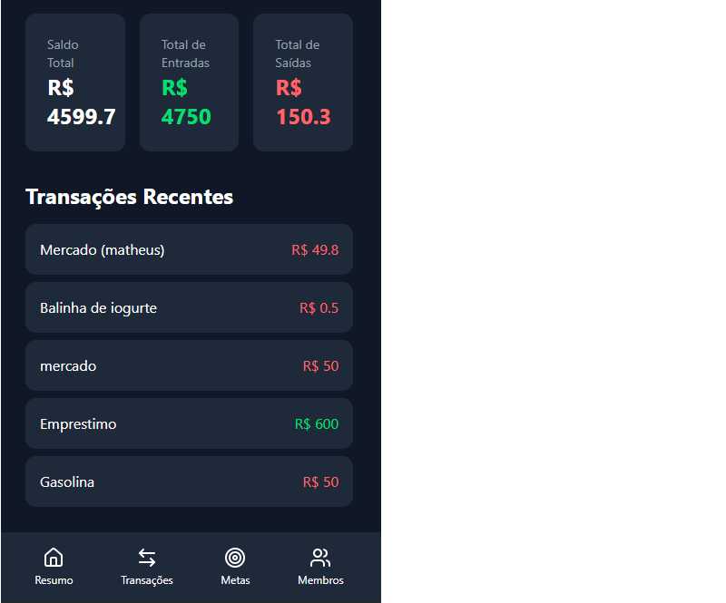
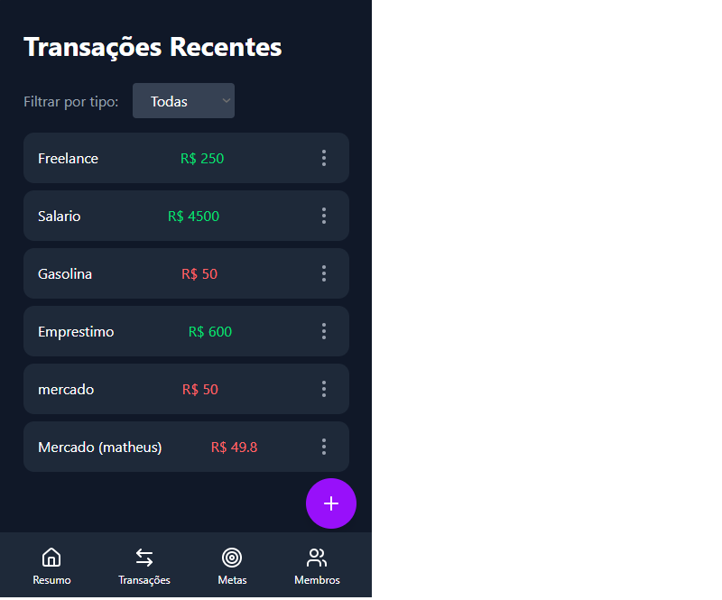
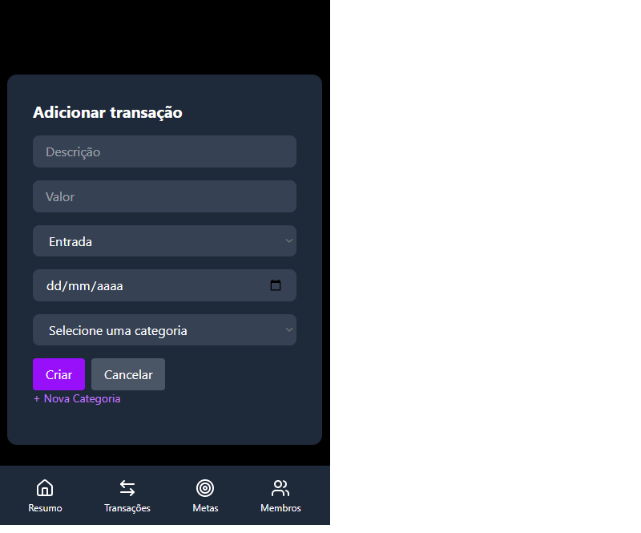
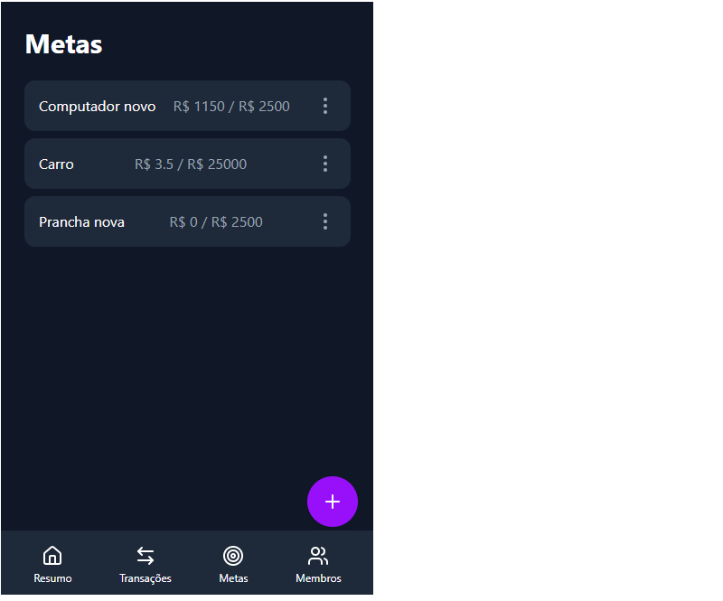
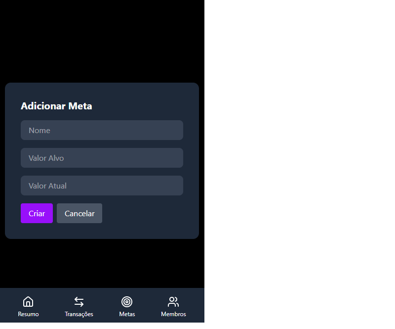
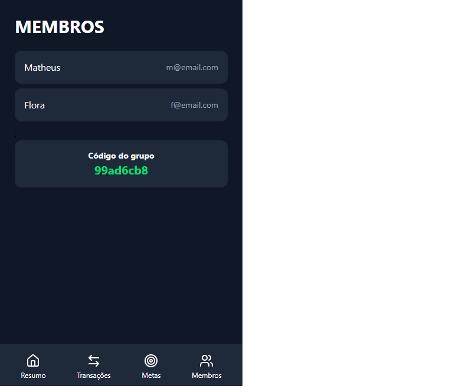

# 👫 JUNTOS

> Um app de finanças compartilhadas para casais e famílias organizarem o dinheiro juntos.

JUNTOS nasceu de uma conversa descontraída entre eu e minha esposa sobre a dificuldade de organizar as finanças do casal. A partir dessa ideia, construí um app full-stack completo — do banco de dados ao deploy em produção — para resolver esse problema real.

🔗 **[Acesse o app em produção](https://juntos-financas.netlify.app)**

---

## 📱 Sobre o projeto

O JUNTOS permite que grupos (casais, famílias, repúblicas) compartilhem o controle financeiro em um único lugar: transações, metas de economia e orçamentos, tudo sincronizado entre todos os membros do grupo através de um código de convite.

Cada usuário se cadastra, cria ou entra em um grupo usando um código único, e a partir daí todas as transações, metas e dados financeiros são compartilhados entre os membros daquele grupo — sem misturar dados de outros grupos.

## ✨ Funcionalidades

- 🔐 **Autenticação completa** — cadastro e login com JWT e senhas criptografadas (bcrypt)
- 👥 **Grupos compartilhados** — crie um grupo ou entre em um existente via código de convite
- 💰 **Transações** — CRUD completo de entradas e saídas, com categorias personalizáveis (nome, emoji e cor)
- 🎯 **Metas financeiras** — crie metas, edite, adicione valor ao progresso e acompanhe quanto falta
- 📊 **Resumo financeiro** — saldo, entradas e saídas do mês atual, com as transações mais recentes
- 🧑‍🤝‍🧑 **Membros** — visualize quem faz parte do seu grupo e o código de convite para adicionar mais pessoas
- 📱 **Mobile-first** — interface pensada para uso no celular, com navegação inferior (bottom nav)

## 🖼️ Screenshots

<table>
  <tr>
    <td><strong>Resumo</strong></td>
    <td><strong>Transações</strong></td>
  </tr>
  <tr>
    <td></td>
    <td></td>
  </tr>
  <tr>
    <td><strong>Adicionar transação</strong></td>
    <td><strong>Metas</strong></td>
  </tr>
  <tr>
    <td></td>
    <td></td>
  </tr>
  <tr>
    <td><strong>Adicionar meta</strong></td>
    <td><strong>Membros</strong></td>
  </tr>
  <tr>
    <td></td>
    <td></td>
  </tr>
</table>

## 🛠️ Stack tecnológica

**Frontend**
- React + Vite
- Tailwind CSS
- React Router DOM
- Axios
- Lucide React (ícones)

**Backend**
- Node.js + Express
- SQLite (`better-sqlite3`)
- JWT (autenticação)
- bcrypt (hash de senhas)

**Deploy**
- Backend → [Render](https://render.com)
- Frontend → [Netlify](https://netlify.com)

## 🔒 Decisões de arquitetura e segurança

Alguns pontos que valem destaque sobre como o projeto foi construído:

- **Isolamento de dados por grupo**: toda rota autenticada usa um middleware (`verificarGrupo`) que garante que o usuário só acesse dados do seu próprio grupo. O `grupo_id` nunca é aceito vindo do corpo da requisição — ele é sempre derivado do token do usuário autenticado, evitando que alguém manipule a requisição para acessar dados de outro grupo.
- **Senhas nunca expostas**: rotas que retornam dados de usuários (como a lista de membros) filtram explicitamente os campos retornados, nunca enviando o hash da senha para o frontend.
- **Tokens com expiração**: os JWTs expiram em 1 hora, exigindo novo login após esse período.
- **Reaproveitamento de modal para criar/editar**: ao invés de duplicar formulários, o frontend usa um único modal que alterna entre os modos de criação e edição com base no estado da entidade selecionada — reduzindo duplicação de código.

## 🚀 Rodando localmente

### Pré-requisitos
- Node.js instalado
- npm

### Backend

```bash
cd backend
npm install
```

Crie um arquivo `.env` na pasta `backend` com:

```
JWT_SECRET=sua_chave_secreta
PORT=4000
```

Inicie o servidor:

```bash
npm start
```

### Frontend

```bash
cd frontend
npm install
```

Crie um arquivo `.env` na pasta `frontend` com:

```
VITE_API_URL=http://localhost:4000
```

Inicie o servidor de desenvolvimento:

```bash
npm run dev
```

## 📁 Estrutura do projeto

```
JUNTOS/
├── backend/
│   ├── middleware/       # authMiddleware, verificarGrupo
│   ├── routes/           # auth, grupos, categorias, transações, metas, orçamentos, resumo
│   ├── banco.js          # criação das tabelas SQLite
│   └── server.js
└── frontend/
    └── src/
        ├── components/   # BottomNav, RotaProtegida
        ├── pages/        # Login, Cadastro, Grupos, Resumo, Transações, Metas, Membros
        └── services/     # configuração do Axios
```

## 🗺️ Próximos passos

- [ ] Migrar o banco de dados de SQLite para **PostgreSQL**, para suportar persistência real em produção
- [ ] Implementar a tela de Orçamentos (rota já existe no backend)
- [ ] Adicionar gráfico de gastos por categoria no Resumo
- [ ] Melhorar feedback visual de erros (substituir `alert()` por componentes de notificação)
- [ ] Adicionar loading states mais refinados em todas as telas

## 👤 Autor

Desenvolvido por Matheus Varela da Luz [DaluzCL](https://github.com/DaluzCL) — meu primeiro projeto full-stack completo, construído do zero como forma de aprender desenvolvimento web na prática, resolvendo um problema real do dia a dia.

---

⭐ Se esse projeto te ajudou de alguma forma, considere deixar uma estrela no repositório!